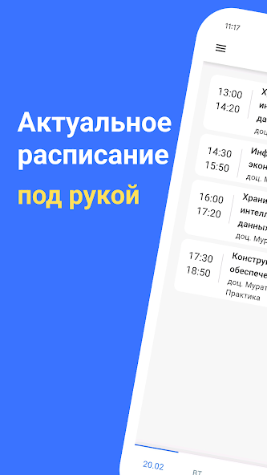
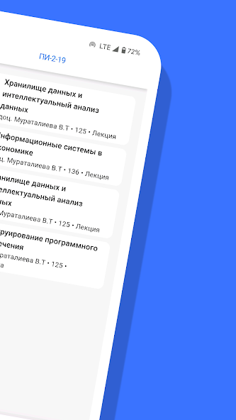
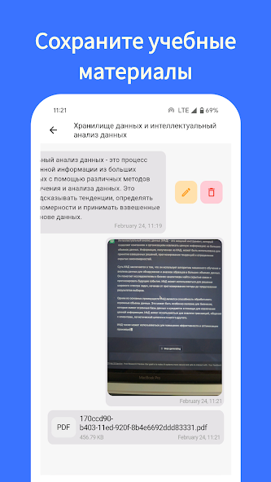
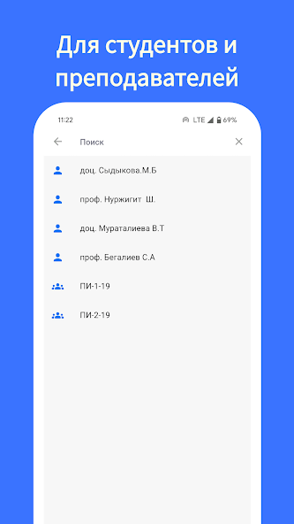

# Tizme - teacher, student, schedule

A convenient tool that allows students and teachers to regularly attend classes and group events online. It can conduct sessions according to the schedule of lectures, seminars, practical classes, exam groups, as well as other events that are taken into account in academic activities. The app can be accessed both on smartphones and through the WEB, allowing for easy and quick access to schedule information anywhere and at any time.

# Screenshots

# Dev commands
fvm flutter packages pub run build_runner build --delete-conflicting-outputs
fvm flutter pub run easy_localization:generate -f keys -o locale_keys.g.dart --source-dir ./assets/translations
fvm flutter pub run flutter_launcher_icons:main
fvm flutter pub run flutter_native_splash:create
